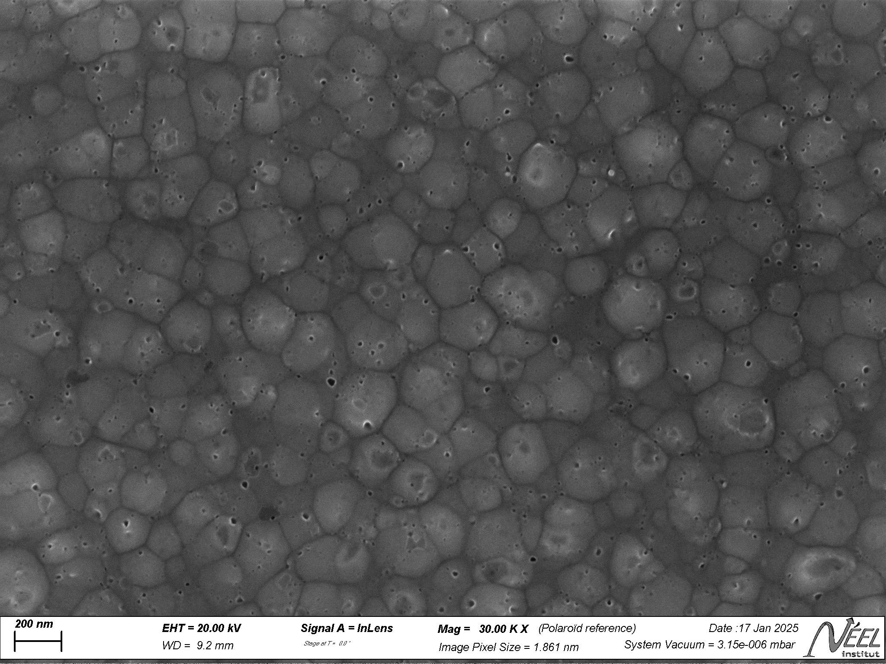

# Automated SEM labelling_ReadMe

## What will this code do

After image acquisition one will save SEM images as shown in the image below. While the banner is great for some Meta data, put not ideal for presentations and publicatoins.

For those applications this code ist here. The Scale bar and it's caption on the left side of the banner will be recognized automatically and then transfered on a banner free image. The size of the label background is proportoinal to the image size.

## What do you need

It start s with the image acquisiton, when the images are saved a subset of image has to be saved. This subset does not have a banner and is called ***PlainImages*** by default of the Zeiss SmartSEM software. These images should be kept as a subfolder in the image folder.

## What will come up next

- Improved text recognition
- Drag&Drop of images instead of numbered lst to select from
